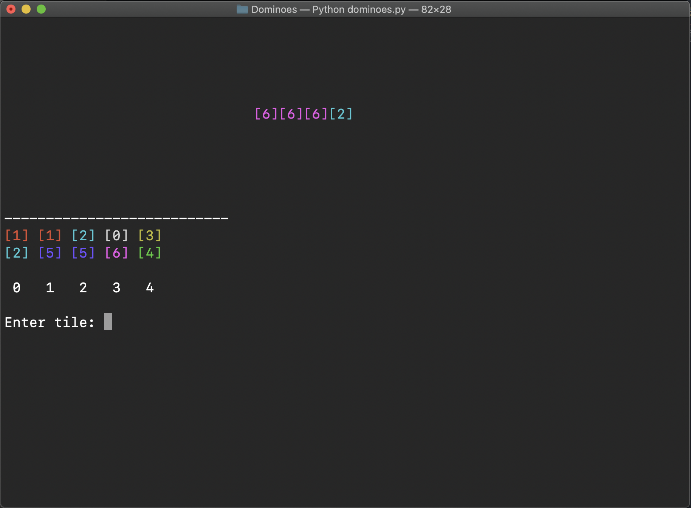

# Terminal Tiles
The old-fashioned game of Dominoes implemented on a terminal console. The user plays against a computer until all possible dominoes have been played. The player with the highest score at the end of a round wins.

## ⚒️ Installation

Use the package manager [pip](https://pip.pypa.io/en/stable/) to install termcolor.

```bash
pip install termcolor
```

## 💻 Usage

```python
b = Board()    # creates board object
player = b.deck.getHand() # creates hand object
b.print()      # prints board object
player.print() # print's hand object
```
## 🚀 Building and Running

```bash
python3 dominoes.py
```

## 🚨 Contributing
Pull requests are welcome. For major changes, please open an issue first to discuss what you would like to change.

Please make sure to update tests as appropriate.

## 💳 License
https://github.com/mcesar96/dominoes_game/blob/master/LICENSE



